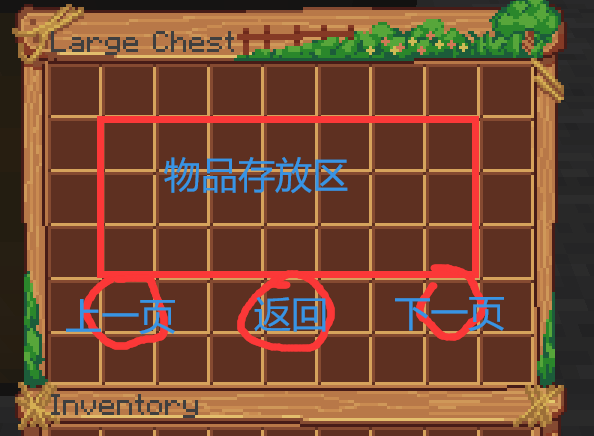
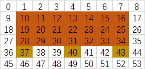

# OxygenVault需求分析

> 定制人：851646427（Azitate）【白夜】 
> 价格：500 
> 订金：已支付500RMB 

## 要求

1. 箱子界面 
   
2. 上一页（无需付费）/下一页（付费解锁，有最大值限制）
3. 返回（可自定义返回指令）
4. 支持MySQL数据库
5. 点券和金币消耗
6. 存取物品均消耗金币
7. 物品支持RGB以及CustomModelData
8. 管理员可查看其他玩家仓库
9. 命令打开仓管

### 　UI分布图

### 时间

- 预计开始时间：2021年9月9日
- 预计结束时间：2021年9月14日
- 实际开始时间：2021年9月9日
- 实际结束日期：2021年9月13日
- 技术售后支持：2021年9月14日-2021年12月31日
- 售后支持：2021年12月31日-？？？？年？？月？？日

### 售后内容

- BUG修复
- 功能调整
- 一个小型插件定制免费定制权
- 